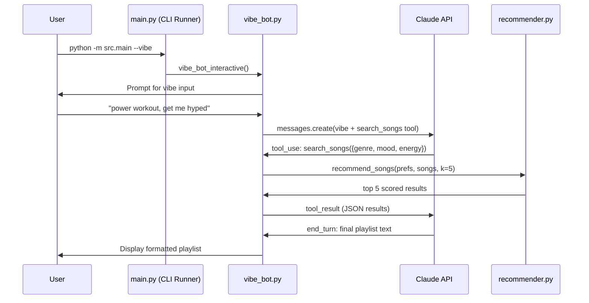
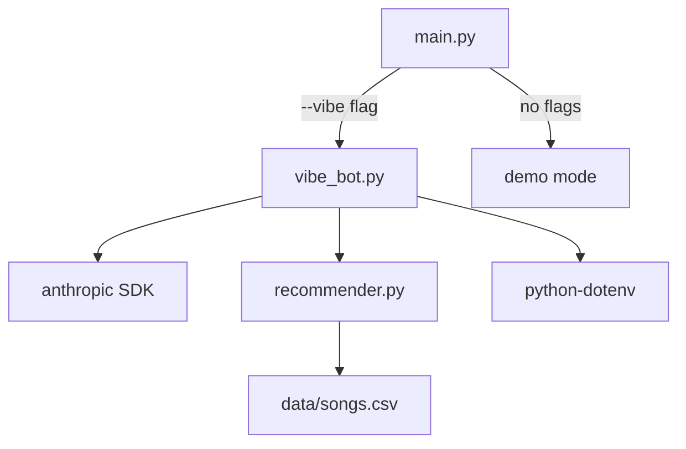
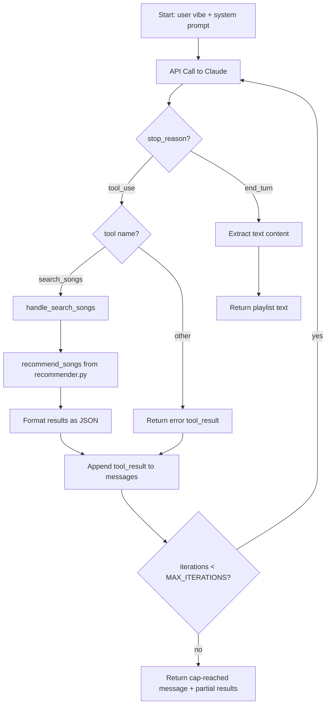

# Design Document — Vibe Bot

## Overview

Vibe Bot adds an interactive CLI mode to VibeMatch where users describe an activity or mood in natural language and receive a curated 5-song playlist with explanations. The feature uses an agentic workflow powered by the Anthropic Claude API (`claude-haiku-4-5-20251001`) with tool use (function calling). Claude interprets the user's vibe, calls a `search_songs` tool backed by the existing `recommend_songs()` scoring pipeline, reads the results, optionally re-queries with adjusted parameters, and produces a final playlist with personalized explanations.

The design adds two new CLI flags (`--vibe`, `--debug`), a new module (`src/vibe_bot.py`), and a configuration template (`.env.example`). The agentic loop is capped at 6 API calls per session to prevent runaway costs.

## Architecture

### High-Level Flow



### Module Dependency Graph



### Key Architectural Decisions

1. **Single new module (`src/vibe_bot.py`)**: All agentic logic lives in one file. This keeps the existing `recommender.py` and `main.py` clean and avoids over-engineering for a student project with a single tool.

2. **Tool use over prompt engineering**: Claude calls `search_songs` as a structured tool rather than being prompted to output JSON. This gives us validated parameters, clear separation between Claude's reasoning and our scoring pipeline, and the ability for Claude to iterate on its search.

3. **Reuse existing scoring pipeline**: The `search_songs` tool wraps `recommend_songs()` directly. No new scoring logic is introduced — the AI layer sits on top of the existing algorithm.

4. **Synchronous client**: The `anthropic.Anthropic()` synchronous client is used since this is a CLI tool with a single user waiting for a response. No need for async complexity.

## Components and Interfaces

### 1. CLI Runner (`src/main.py` — modified)

**Changes**: Add `argparse` with `--vibe` and `--debug` flags.

```python
def parse_args() -> argparse.Namespace:
    """Parse CLI arguments for demo mode or vibe bot mode."""
    parser = argparse.ArgumentParser(description="VibeMatch Music Recommender")
    parser.add_argument("--vibe", action="store_true",
                        help="Launch interactive Vibe Bot mode")
    parser.add_argument("--debug", action="store_true",
                        help="Enable debug logging (only with --vibe)")
    return parser.parse_args()

def main() -> None:
    args = parse_args()
    if args.vibe:
        from src.vibe_bot import vibe_bot_interactive
        vibe_bot_interactive(debug=args.debug)
    else:
        # existing demo mode (unchanged)
        ...
```

**Design rationale**: `--debug` without `--vibe` is silently ignored per Requirement 1.4. The `vibe_bot` import is deferred to avoid loading the `anthropic` SDK when running demo mode.

### 2. Vibe Bot Module (`src/vibe_bot.py` — new)

This module contains all agentic loop logic. Public interface:

```python
# --- Constants ---
MAX_ITERATIONS: int = 6
MODEL: str = "claude-haiku-4-5-20251001"

# --- Public entry point ---
def vibe_bot_interactive(debug: bool = False) -> None:
    """Main entry point. Validates API key, collects vibe, runs loop, displays result."""

# --- Core agentic loop ---
def run_vibe_bot(vibe_input: str, songs: list[dict], client: anthropic.Anthropic) -> str:
    """Run the agentic loop. Returns the final playlist text or an error/cap message."""

# --- Tool handler ---
def handle_search_songs(tool_input: dict, songs: list[dict]) -> str:
    """Execute search_songs tool call. Returns JSON string of top 5 results."""

# --- Tool definition ---
def get_search_songs_tool() -> dict:
    """Return the search_songs tool definition for the Claude API."""

# --- Display ---
def display_vibe_playlist(vibe_input: str, playlist_text: str) -> None:
    """Print the final playlist with a header showing the original vibe."""

# --- Validation ---
def validate_api_key() -> str:
    """Load .env, check ANTHROPIC_API_KEY. Returns key or raises SystemExit."""
```

### 3. Search Songs Tool Definition

The tool definition exposed to Claude follows the Anthropic tool-use schema:

```python
{
    "name": "search_songs",
    "description": (
        "Search the VibeMatch song catalog for songs matching a vibe. "
        "Returns the top 5 songs ranked by match score. "
        "You can call this multiple times with different parameters to explore the catalog."
    ),
    "input_schema": {
        "type": "object",
        "properties": {
            "genre": {
                "type": "string",
                "description": "The genre to search for.",
                "enum": [
                    "pop", "lofi", "rock", "ambient", "jazz", "synthwave",
                    "indie pop", "hip-hop", "r&b", "classical", "metal",
                    "reggae", "folk", "edm", "blues", "soul"
                ]
            },
            "mood": {
                "type": "string",
                "description": "The mood to search for.",
                "enum": [
                    "happy", "chill", "intense", "relaxed", "moody",
                    "focused", "confident", "romantic", "melancholic",
                    "aggressive", "dreamy", "sad", "euphoric", "nostalgic",
                    "tender"
                ]
            },
            "energy": {
                "type": "number",
                "description": "Target energy level from 0.0 (calm) to 1.0 (intense)."
            }
        },
        "required": ["genre", "mood", "energy"]
    }
}
```

**Design rationale**: The `enum` constraints for genre and mood give Claude the exact vocabulary from the catalog. This prevents mismatches like `"indie-pop"` vs `"indie pop"` that would cause `score_song()` to miss the genre bonus. Energy is a free float since the scoring uses proximity, not equality.

### 4. System Prompt

The system prompt instructs Claude on its role and constraints:

```
You are VibeMatch DJ, a music recommendation assistant. The user will describe
an activity, mood, or scenario. Your job is to:

1. Interpret their vibe and decide on genre, mood, and energy parameters
2. Use the search_songs tool to find matching songs from the catalog
3. Review the results — if they don't feel right, search again with different parameters
4. Once you have good results, write a playlist with exactly 5 songs

Format your final response as a numbered playlist. For each song include:
- Song title and artist
- A brief explanation of why it fits the vibe

Keep explanations concise and conversational. Do not include scores or technical details.
```

### 5. Agentic Loop Logic



The loop maintains a `messages` list that accumulates the conversation history. Each iteration:

1. Calls `client.messages.create()` with the full message history and tool definition
2. Checks `response.stop_reason`:
   - `"tool_use"`: Extract tool name and input, execute handler, append `tool_result` to messages
   - `"end_turn"`: Extract final text content, return it
3. Increments iteration counter; if it hits `MAX_ITERATIONS`, stop and return partial results

### 6. Error Handling Strategy

| Error Type | Detection | User Message | Log Level |
|---|---|---|---|
| Missing API key | `ANTHROPIC_API_KEY` not in env | "API key not found. See .env.example for setup instructions." | ERROR |
| Auth error | `anthropic.AuthenticationError` | "Invalid API key. Check your .env file." | ERROR |
| Rate limit / server error | `anthropic.RateLimitError`, `anthropic.APIStatusError` | "API error: {details}. Try again later." | ERROR |
| Unknown tool name | `tool_name != "search_songs"` | (returned as tool_result error to Claude) | WARNING |
| Iteration cap reached | `iterations >= MAX_ITERATIONS` | "Reached iteration limit. Here's what I found so far..." | WARNING |
| Unexpected exception | Catch-all `Exception` | "Something went wrong. Check logs for details." | ERROR |

### 7. Recommender Integration (`src/recommender.py` — unchanged)

The existing functions are used as-is:

- `load_songs(csv_path)` → loads the 19-song catalog
- `recommend_songs(user_prefs, songs, k=5)` → returns `list[tuple[dict, float, str]]`

The `handle_search_songs` function constructs `user_prefs` from Claude's tool input and calls `recommend_songs()`. Results are serialized to JSON containing title, artist, genre, mood, energy, and match score.

## Data Models

### Tool Input (from Claude)

```python
# Claude sends this as tool_input when calling search_songs
{
    "genre": str,   # one of 16 catalog genres
    "mood": str,    # one of 15 catalog moods
    "energy": float # 0.0 to 1.0, clamped if out of range
}
```

### Tool Result (returned to Claude)

```python
# JSON string returned as tool_result content
[
    {
        "title": str,
        "artist": str,
        "genre": str,
        "mood": str,
        "energy": float,
        "score": float  # 0.0 to 5.75
    },
    # ... up to 5 songs
]
```

### Message History (internal state)

The agentic loop maintains a list of message dicts following the Anthropic API format:

```python
messages = [
    {"role": "user", "content": "I need music for a power workout"},
    # Claude's response with tool_use block is appended by the SDK
    {"role": "assistant", "content": [...]},  # contains tool_use block
    {"role": "user", "content": [{"type": "tool_result", "tool_use_id": "...", "content": "..."}]},
    # ... continues until end_turn
]
```

### Energy Clamping

Per Requirement 9.5, energy values from Claude are clamped to `[0.0, 1.0]`:

```python
energy = max(0.0, min(1.0, tool_input.get("energy", 0.5)))
```

### Configuration

| Item | Value |
|---|---|
| Model | `claude-haiku-4-5-20251001` |
| MAX_ITERATIONS | 6 |
| Top-k results | 5 |
| Max score | 5.75 (genre 1.25 + mood 1.5 + energy 3.0) |

## Correctness Properties

*A property is a characteristic or behavior that should hold true across all valid executions of a system — essentially, a formal statement about what the system should do. Properties serve as the bridge between human-readable specifications and machine-verifiable correctness guarantees.*

### Property 1: Energy clamping produces bounded output

*For any* float value provided as the energy parameter in a tool input, the clamped energy value SHALL always be within the range [0.0, 1.0], and SHALL equal `max(0.0, min(1.0, value))` — meaning values below 0.0 become 0.0, values above 1.0 become 1.0, and values already in range are unchanged.

**Validates: Requirements 9.4, 9.5**

### Property 2: Search songs tool returns valid structured results

*For any* valid tool input (genre from the 16 catalog genres, mood from the 15 catalog moods, energy in [0.0, 1.0]), `handle_search_songs` SHALL return a valid JSON string that deserializes to a list of at most 5 items, where each item contains the keys `title` (string), `artist` (string), `genre` (string), `mood` (string), `energy` (number), and `score` (number).

**Validates: Requirements 4.3, 9.1, 9.3**

### Property 3: Agentic loop respects iteration cap

*For any* sequence of Claude API responses that always return `tool_use` stop reasons (i.e., Claude never produces `end_turn`), the agentic loop SHALL make at most `MAX_ITERATIONS` (6) API calls before terminating.

**Validates: Requirements 5.1**

### Property 4: Playlist display includes original vibe input

*For any* non-empty vibe input string and any playlist text, `display_vibe_playlist` SHALL produce output that contains the original vibe input string.

**Validates: Requirements 6.2**

## Error Handling

### Error Categories and Responses

| Category | Exception Type | User-Facing Message | Recovery |
|---|---|---|---|
| Missing API key | `SystemExit` via `validate_api_key()` | "Error: ANTHROPIC_API_KEY not found. Copy .env.example to .env and add your key. Get one at console.anthropic.com." | Exit with code 1 |
| Invalid API key | `anthropic.AuthenticationError` | "Error: Invalid API key. Check your .env file." | Exit with code 1 |
| Rate limit | `anthropic.RateLimitError` | "Error: API rate limit reached. Please try again in a few minutes." | Exit with code 1 |
| Server error | `anthropic.APIStatusError` | "Error: Claude API returned an error ({status}). Try again later." | Exit with code 1 |
| Iteration cap | Loop counter check | "Reached the iteration limit ({MAX_ITERATIONS} API calls). Here's what I found so far:" | Display partial results |
| Unknown tool | Tool name check | (Returned to Claude as tool_result error) | Continue loop |
| Unexpected error | `Exception` catch-all | "Something went wrong. Run with --debug for more details." | Log full traceback, exit with code 1 |

### Error Handling Flow

```python
def run_vibe_bot(vibe_input: str, songs: list[dict], client: anthropic.Anthropic) -> str:
    try:
        # ... agentic loop ...
    except anthropic.AuthenticationError:
        logger.error("Authentication failed")
        return "Error: Invalid API key. Check your .env file."
    except anthropic.RateLimitError:
        logger.error("Rate limit exceeded")
        return "Error: API rate limit reached. Please try again in a few minutes."
    except anthropic.APIStatusError as e:
        logger.error("API error: %s", e)
        return f"Error: Claude API returned an error ({e.status_code}). Try again later."
    except Exception as e:
        logger.error("Unexpected error in agentic loop", exc_info=True)
        return "Something went wrong. Run with --debug for more details."
```

### Graceful Degradation

- If the catalog fails to load (`load_songs` raises `SystemExit`), the error is caught before the agentic loop starts
- If Claude returns an unknown tool name, an error message is sent back as a `tool_result` so Claude can self-correct
- If the iteration cap is reached, any tool results collected during the session are summarized in the output

## Testing Strategy

### Testing Approach

The test suite uses a dual approach:

1. **Property-based tests** (via `hypothesis`) — verify universal properties across many generated inputs
2. **Example-based unit tests** (via `pytest`) — verify specific scenarios, edge cases, error handling, and integration points

Property-based testing is appropriate for this feature because several core functions are pure or near-pure with clear input/output behavior: energy clamping, tool result serialization, and tool input construction. The agentic loop's iteration cap is also a universal invariant.

### Property-Based Testing Configuration

- **Library**: `hypothesis` (standard PBT library for Python)
- **Minimum iterations**: 100 per property test (via `@settings(max_examples=100)`)
- **Each test references its design property** with a tag comment:
  ```python
  # Feature: vibe-bot, Property 1: Energy clamping produces bounded output
  ```

### Test File: `tests/test_vibe_bot.py`

#### Property Tests

| Test | Property | What It Validates |
|---|---|---|
| `test_energy_clamping_bounded` | Property 1 | For any float, clamped energy is in [0.0, 1.0] |
| `test_handle_search_songs_valid_json` | Property 2 | For any valid tool input, returns valid JSON with correct structure |
| `test_agentic_loop_respects_iteration_cap` | Property 3 | For any sequence of tool_use responses, loop stops at MAX_ITERATIONS |
| `test_display_contains_vibe_input` | Property 4 | For any vibe string, display output contains it |

#### Example-Based Unit Tests

| Test | What It Validates | Requirements |
|---|---|---|
| `test_parse_args_vibe_flag` | --vibe flag launches vibe mode | 1.1 |
| `test_parse_args_no_flags_demo` | No flags runs demo mode | 1.2 |
| `test_parse_args_debug_with_vibe` | --debug --vibe sets debug=True | 1.3 |
| `test_parse_args_debug_without_vibe` | --debug alone runs demo mode | 1.4 |
| `test_validate_api_key_missing` | Missing key shows error and exits | 2.2 |
| `test_validate_api_key_empty` | Empty key shows error and exits | 2.2 |
| `test_validate_api_key_present` | Valid key returns key string | 2.3 |
| `test_empty_vibe_input_reprompts` | Empty input triggers re-prompt | 3.2 |
| `test_tool_definition_genres` | Tool def contains all 16 genres | 4.5 |
| `test_tool_definition_moods` | Tool def contains all 15 moods | 4.6 |
| `test_unknown_tool_returns_error` | Unknown tool name gets error result | 4.7 |
| `test_iteration_cap_message` | Cap reached shows informative message | 5.2 |
| `test_auth_error_handling` | AuthenticationError shows key message | 8.1 |
| `test_rate_limit_error_handling` | RateLimitError suggests retry | 8.2 |
| `test_unexpected_error_handling` | Generic exception shows friendly message | 8.3 |

### Mocking Strategy

- **Anthropic client**: Mocked with `unittest.mock.MagicMock` to simulate tool_use and end_turn responses
- **`recommend_songs()`**: Called with real catalog data for property tests; mocked for unit tests that focus on loop logic
- **`input()`**: Mocked via `unittest.mock.patch("builtins.input")` for interactive prompt tests
- **Environment variables**: Mocked via `unittest.mock.patch.dict(os.environ, ...)` for API key tests
- **`load_dotenv`**: Mocked to prevent side effects during testing

### Dependencies to Add

```
hypothesis
```

Add to `requirements.txt` for property-based testing support.

