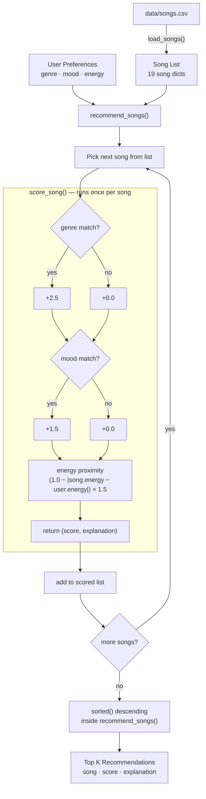

# 🎵 Music Recommender Simulation

## Project Summary

In this project you will build and explain a small music recommender system.

Your goal is to:

- Represent songs and a user "taste profile" as data
- Design a scoring rule that turns that data into recommendations
- Evaluate what your system gets right and wrong
- Reflect on how this mirrors real world AI recommenders

Replace this paragraph with your own summary of what your version does.

---

## How The System Works

Real-world recommendation systems like Spotify's do two things at once — they look at what songs have in common (content signals like energy and genre) and they look at what users with similar taste tend to listen to (collaborative signals). This version focuses on the content side, which is realistic for a small catalog without a user base to draw collaborative signals from.

The pipeline has three steps:

1. **`load_songs()`** reads `data/songs.csv` and returns a list of 19 song dictionaries, converting all numeric columns (energy, tempo_bpm, valence, danceability, acousticness) from raw strings to floats so math can be done on them.
2. **`score_song()`** acts as the judge. It is called once per song and compares that song's attributes against the user's taste profile, awarding points for genre match, mood match, and energy proximity. It returns both a numeric score and a list of human-readable reasons so every recommendation is explainable (e.g. `"genre match (+2.5); mood miss: chill != happy (+0.0); energy proximity (+1.47)"`).
3. **`recommend_songs()`** drives the full pipeline. It loops through all 19 songs, calls `score_song` on each one, and then ranks the results using Python's `sorted()`. It returns the top k results as `(song, score, explanation)` tuples.

### Features in Use

**Song object:**

- `genre` — broad style family (pop, jazz, lofi, etc.)
- `mood` — emotional vibe (chill, intense, relaxed, etc.)
- `energy` — how loud and intense the song is, 0 to 1
- `tempo_bpm` — speed of the song
- `valence` — how positive or bright it sounds, 0 to 1
- `danceability` — how groove-driven the beat is, 0 to 1
- `acousticness` — how organic vs. electronic it sounds, 0 to 1
- `artist` — for later when catalog is bigger

**UserProfile object:**

- `favorite_genre` — what genre they identify with most
- `favorite_mood` — the vibe they're usually going for
- `target_energy` — what energy level they want
- `likes_acoustic` — whether they prefer organic or produced sound

---

### Algorithm Recipe

This system uses **content-based filtering with explicit taste onboarding** — the user tells it their preferences upfront, and every song gets scored against those preferences. Collaborative signals (what users with similar taste listen to) and a feedback loop are planned for a later version once there's enough user data to make them useful.

**Weight hierarchy:**

| Signal | Logic | Points |
|---|---|---|
| Genre | Binary match — right genre or not | +2.5 |
| Mood | Binary match — right mood or not | +1.5 |
| Energy | Proximity: `(1.0 - abs(song.energy - user.target_energy)) × 1.5` | 0 to +1.5 |

Genre carries the most weight because it's identity-level — a user who says they like jazz is probably not trying to hear rock no matter what the energy is. Mood is weighted second because it's a strong signal but more contextual (the same user might want chill on some days and intense on others). Energy sits below the binary signals but uses a proximity formula instead of a match/no-match check, so a song that's close to the target energy still earns partial credit.

**Scoring and ranking are kept as separate concerns:**

- **Scoring** (`score_song`) — answers "how well does this one song match?" for a single song at a time. No knowledge of other songs.
- **Ranking** (the `sorted()` call inside `recommend_songs`) — takes all the scored tuples and sorts them highest-to-lowest. `sorted()` is used instead of `.sort()` because it returns a new list without modifying the original catalog. This is the extension point for future rules like no-repeat-artist filters or diversity boosts, without touching the scoring math.

---

### Data Flow

This diagram shows how a single song travels from the CSV file to a ranked recommendation. The scoring box runs once per song; ranking happens after all songs have been scored.



---

### Known Biases

- **Genre dominance** — at +2.5, a genre match outweighs a nearly perfect energy + mood match combined. A genuinely great song in the wrong genre will rarely surface.
- **Mood miss is costly** — a song that is the right genre and perfect energy but wrong mood loses 1.5 points with no partial credit. The system treats mood as all-or-nothing, which doesn't reflect how listeners actually feel (a slightly-off mood song can still land).
- **Energy is the only continuous signal** — valence, acousticness, and tempo are not used in v1, so two songs that feel very different can score identically if they share genre, mood, and similar energy.
- **No discovery** — purely content-based scoring creates a filter bubble. The system keeps recommending songs close to what the user already said they like and has no mechanism to surface something unexpected that might become a favorite.


---


 
 

## Getting Started

### Setup

1. Create a virtual environment (optional but recommended):

   ```bash
   python -m venv .venv
   source .venv/bin/activate      # Mac or Linux
   .venv\Scripts\activate         # Windows

2. Install dependencies

```bash
pip install -r requirements.txt
```

3. Run the app:

```bash
python -m src.main
```

### Running Tests

Run the starter tests with:

```bash
pytest
```

You can add more tests in `tests/test_recommender.py`.

---

## Experiments You Tried

Use this section to document the experiments you ran. For example:

- What happened when you changed the weight on genre from 2.0 to 0.5
- What happened when you added tempo or valence to the score
- How did your system behave for different types of users

---

## Limitations and Risks

Summarize some limitations of your recommender.

Examples:

- It only works on a tiny catalog
- It does not understand lyrics or language
- It might over favor one genre or mood

You will go deeper on this in your model card.

---

## Reflection

Read and complete `model_card.md`:

[**Model Card**](model_card.md)

Write 1 to 2 paragraphs here about what you learned:

- about how recommenders turn data into predictions
- about where bias or unfairness could show up in systems like this


---

## 7. `model_card_template.md`

Combines reflection and model card framing from the Module 3 guidance. :contentReference[oaicite:2]{index=2}  

```markdown
# 🎧 Model Card - Music Recommender Simulation

## 1. Model Name

Give your recommender a name, for example:

> VibeFinder 1.0

---

## 2. Intended Use

- What is this system trying to do
- Who is it for

Example:

> This model suggests 3 to 5 songs from a small catalog based on a user's preferred genre, mood, and energy level. It is for classroom exploration only, not for real users.

---

## 3. How It Works (Short Explanation)

Describe your scoring logic in plain language.

- What features of each song does it consider
- What information about the user does it use
- How does it turn those into a number

Try to avoid code in this section, treat it like an explanation to a non programmer.

---

## 4. Data

Describe your dataset.

- How many songs are in `data/songs.csv`
- Did you add or remove any songs
- What kinds of genres or moods are represented
- Whose taste does this data mostly reflect

---

## 5. Strengths

Where does your recommender work well

You can think about:
- Situations where the top results "felt right"
- Particular user profiles it served well
- Simplicity or transparency benefits

---

## 6. Limitations and Bias

Where does your recommender struggle

Some prompts:
- Does it ignore some genres or moods
- Does it treat all users as if they have the same taste shape
- Is it biased toward high energy or one genre by default
- How could this be unfair if used in a real product

---

## 7. Evaluation

How did you check your system

Examples:
- You tried multiple user profiles and wrote down whether the results matched your expectations
- You compared your simulation to what a real app like Spotify or YouTube tends to recommend
- You wrote tests for your scoring logic

You do not need a numeric metric, but if you used one, explain what it measures.

---

## 8. Future Work

If you had more time, how would you improve this recommender

Examples:

- Add support for multiple users and "group vibe" recommendations
- Balance diversity of songs instead of always picking the closest match
- Use more features, like tempo ranges or lyric themes

---

## 9. Personal Reflection

A few sentences about what you learned:

- What surprised you about how your system behaved
- How did building this change how you think about real music recommenders
- Where do you think human judgment still matters, even if the model seems "smart"

