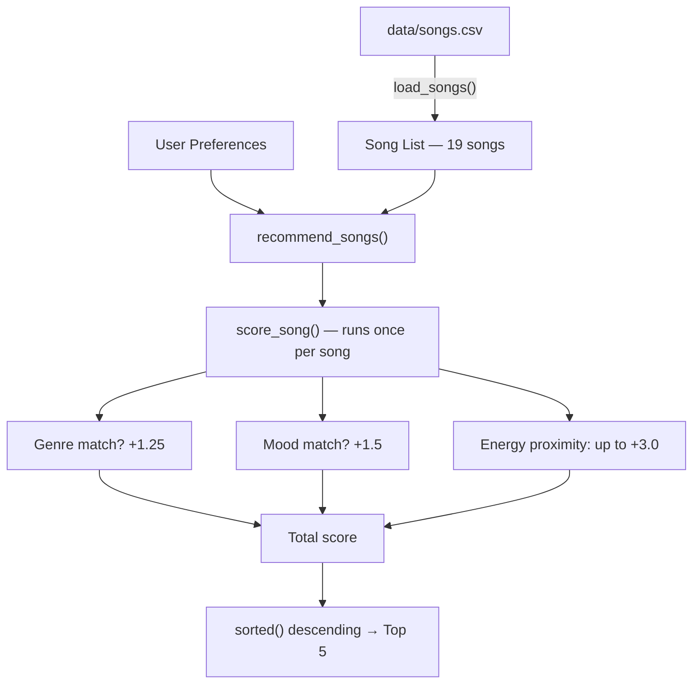
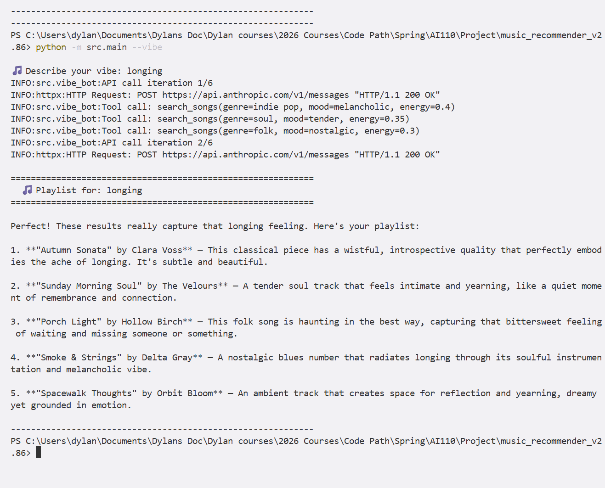
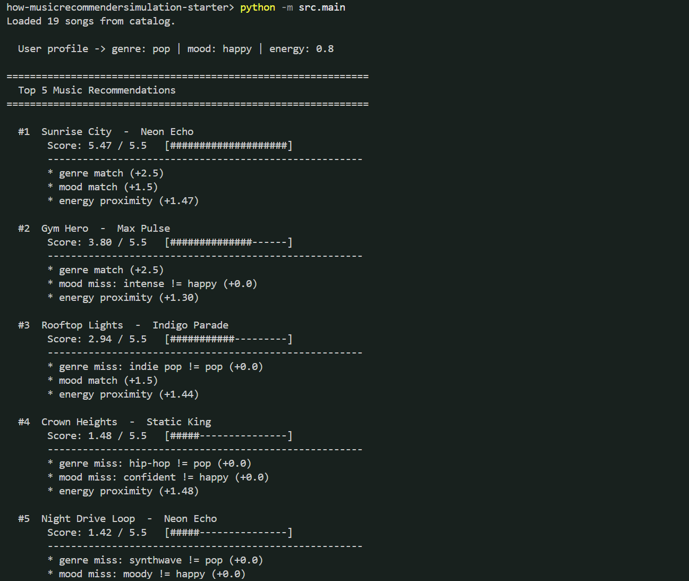

# 🎵 VibeMatch — Music Recommender with AI-Powered Vibe Bot

## Project Summary

VibeMatch is a content-based music recommender that scores 19 songs against a user's genre, mood, and energy preferences. It has two modes:

1. **Demo mode** — runs three hardcoded user profiles and prints ranked playlists with score breakdowns.
2. **Vibe Bot mode** — an interactive CLI where you describe an activity or mood in plain English (e.g., "study for finals", "power workout") and an AI agent builds you a curated 5-song playlist with explanations.

The Vibe Bot runs on an agentic loop using the Claude API. You describe your vibe, Claude figures out what that means, hits a search_songs tool that's wired into the existing scoring pipeline, checks the results, and either refines the search or locks in a final playlist. It's just an AI layer on top of the same algorithm demo mode uses — the scoring system doesn't change.

### Original Project

This started as the **Music Recommender Simulation** from week 6 — a basic content-based recommender that scored songs against hardcoded user profiles using genre, mood, and energy matching, then printed ranked playlists. The original version had no AI, no interactivity, and no way to describe what you wanted in plain language. VibeMatch keeps that same scoring engine but adds the Vibe Bot on top, so now you can just say what you're doing and get a playlist back.

**Course:** CodePath AI110 — Spring 2026
**Language:** Python

---

## How It Works

### Scoring Pipeline

The core algorithm scores every song in the catalog against user preferences using three signals:

| Signal | Logic | Points |
|--------|-------|--------|
| Genre | Binary match — right genre or not | +1.25 |
| Mood | Binary match — right mood or not | +1.5 |
| Energy | Proximity: `(1.0 - abs(song.energy - user.energy)) × 3.0` | 0 to +3.0 |

**Max possible score: 5.75** (genre 1.25 + mood 1.5 + energy 3.0)

Energy carries the most weight because it's the only continuous signal — a song close to the target energy still earns partial credit, while genre and mood are all-or-nothing.

### Vibe Bot (Agentic Workflow)

When you run `--vibe` mode, here's what happens under the hood:

1. You type a vibe like "lazy Sunday morning with coffee"
2. The system sends your vibe to Claude with a `search_songs` tool definition
3. Claude interprets your vibe and decides on genre, mood, and energy parameters
4. Claude calls `search_songs` — which runs the real `recommend_songs()` scoring pipeline
5. Claude reads the results, optionally searches again with different parameters
6. Claude writes a numbered playlist with explanations for each song pick

The loop is capped at 6 API calls per session to prevent runaway costs. In practice, most interactions take 2-3 calls.

### Data Flow



---

## Song Catalog

The catalog (`data/songs.csv`) contains 19 songs across 16 genres and 15 moods.

**Genres (16):** pop, lofi, rock, ambient, jazz, synthwave, indie pop, hip-hop, r&b, classical, metal, reggae, folk, edm, blues, soul

**Moods (15):** happy, chill, intense, relaxed, moody, focused, confident, romantic, melancholic, aggressive, dreamy, sad, euphoric, nostalgic, tender

**Energy range:** 0.22 (Autumn Sonata / classical) to 0.96 (Iron Curtain / metal)

---

## Getting Started

### Prerequisites

- Python 3.10 or higher
- An Anthropic API key (only needed for Vibe Bot mode)

### Setup

1. Clone the repository and create a virtual environment:

```bash
python -m venv .venv
source .venv/bin/activate      # Mac / Linux
.venv\Scripts\activate         # Windows
```

2. Install dependencies:

```bash
pip install -r requirements.txt
```

3. Set up your API key (only needed for Vibe Bot mode):

```bash
cp .env.example .env
```

Open `.env` and paste your Anthropic API key. You can get one at [console.anthropic.com](https://console.anthropic.com).

### Running the App

```bash
# Demo mode — three hardcoded profiles, no API key needed
python -m src.main

# Vibe Bot mode — interactive AI playlist builder
python -m src.main --vibe

# Vibe Bot with debug logging — shows API calls and tool invocations
python -m src.main --vibe --debug
```

### Example Vibes to Try

| Vibe input | What Claude typically picks |
|---|---|
| "I need to study for finals" | lofi / focused / low energy |
| "power workout, get me hyped" | edm or pop / euphoric or intense / high energy |
| "lazy Sunday morning with coffee" | jazz or ambient / relaxed / low energy |
| "driving at night" | synthwave / moody / medium-high energy |

### Sample Interaction

Here's what it actually looks like when you run the Vibe Bot. You type a vibe, Claude interprets it, calls the scoring pipeline behind the scenes, and comes back with a curated playlist and explanations for each pick:



The screenshots below show additional runs with different vibes. Each one goes through the same flow — Claude reads your input, decides on genre/mood/energy parameters, searches the catalog, and writes up the results:




### Video Demo

Watch the full walkthrough here: [VibeMatch Demo on Loom](https://www.loom.com/share/abccbfd6bb0b4dd79b718aef2a762593)

---

## Project Structure

```
music_recommender_v2.86/
├── src/
│   ├── main.py              # CLI runner with --vibe and --debug flags
│   ├── recommender.py       # Core scoring pipeline (load, score, recommend)
│   └── vibe_bot.py          # Vibe Bot module (agentic loop, tool handler, display)
├── tests/
│   ├── test_recommender.py  # 9 unit tests for the scoring pipeline
│   └── test_vibe_bot.py     # 33 tests (unit + property-based) for Vibe Bot
├── data/
│   └── songs.csv            # 19-song catalog
├── .env.example             # API key configuration template
├── requirements.txt         # anthropic, hypothesis, pytest, python-dotenv
├── model_card.md            # Model card with strengths, limitations, evaluation
├── Project_Context.md       # Detailed development log and architecture notes
└── README.md
```

---

## Dependencies

| Package | What it's for |
|---------|---------------|
| `anthropic` | Claude API client for the Vibe Bot agentic loop |
| `python-dotenv` | Loads the API key from `.env` |
| `pytest` | Test runner |
| `hypothesis` | Property-based testing — generates hundreds of random inputs to stress-test correctness |

Install all of them with `pip install -r requirements.txt`.

---

## Tests

The project has **42 tests** across two test files. Run them all with:

```bash
pytest tests/ -v
```

### Recommender Tests (`tests/test_recommender.py`) — 9 tests

These tests verify that the core scoring and ranking algorithm works correctly.

| Test | What it checks |
|------|----------------|
| `test_recommend_returns_correct_count` | Asking for 2 recommendations returns exactly 2 |
| `test_recommend_ranks_matching_song_first` | A pop/happy user gets the pop song ranked above a lofi song |
| `test_recommend_ranks_lofi_first_for_lofi_user` | A lofi/chill user gets the lofi song ranked first |
| `test_recommend_respects_k_limit` | Asking for `k=1` returns only 1 result |
| `test_explain_recommendation_contains_score_and_reasons` | Explanations include "genre match", "mood match", and "energy proximity" |
| `test_explain_recommendation_shows_misses` | When a song doesn't match, the explanation says "genre miss" and "mood miss" |
| `test_score_song_perfect_match` | A song matching genre, mood, and energy exactly scores 5.75 (the maximum) |
| `test_score_song_no_match` | A song with wrong genre, wrong mood, and opposite energy scores below 1.0 |
| `test_recommend_songs_returns_sorted_results` | Results come back sorted highest score first |

**Why these tests matter:** They make sure the scoring math is correct and that rankings behave predictably. If someone changes the weights or scoring logic, these tests catch regressions immediately.

### Vibe Bot Tests (`tests/test_vibe_bot.py`) — 33 tests

These tests cover the entire Vibe Bot feature without making real API calls. The Claude client is mocked in every test that touches the agentic loop.

#### CLI Argument Parsing (8 tests)

Tests that the `--vibe` and `--debug` flags work correctly and dispatch to the right mode.

| Test | What it checks |
|------|----------------|
| `test_vibe_flag_sets_vibe_true` | `--vibe` sets the vibe flag to True |
| `test_no_flags_defaults_to_demo_mode` | No flags means demo mode (vibe is False) |
| `test_debug_with_vibe_sets_both_true` | `--debug --vibe` sets both flags |
| `test_debug_without_vibe_runs_demo_mode` | `--debug` alone still runs demo mode |
| `test_no_flags_runs_demo_mode` | With no flags, `main()` calls the demo path (loads songs, runs 3 profiles) |
| `test_vibe_flag_launches_vibe_mode` | With `--vibe`, `main()` calls `vibe_bot_interactive()` |
| `test_vibe_debug_passes_debug_true` | With `--vibe --debug`, debug=True is passed through |
| `test_debug_without_vibe_runs_demo` | `--debug` without `--vibe` runs demo mode, not vibe bot |

**Why:** These make sure the CLI entry point routes correctly. A user running `python -m src.main` should never accidentally trigger the Vibe Bot (which requires an API key).

#### API Key Validation (3 tests)

| Test | What it checks |
|------|----------------|
| `test_missing_key_shows_error_and_exits` | No API key → prints a helpful error mentioning `.env.example` and exits |
| `test_empty_key_shows_error_and_exits` | Empty string API key → same helpful error and exit |
| `test_valid_key_returns_key_string` | A valid key is returned so the app can use it |

**Why:** Without these, a missing API key would cause a cryptic error deep in the Anthropic SDK instead of a clear message telling the user what to do.

#### Tool Definition (4 tests)

| Test | What it checks |
|------|----------------|
| `test_tool_definition_contains_all_16_genres` | The tool definition lists all 16 genres from the catalog |
| `test_tool_definition_contains_all_15_moods` | The tool definition lists all 15 moods from the catalog |
| `test_tool_definition_has_correct_name` | The tool is named `search_songs` |
| `test_tool_definition_requires_genre_mood_energy` | Genre, mood, and energy are all required fields |

**Why:** Claude uses the tool definition to know what parameters it can send. If a genre or mood is missing from the enum list, Claude can never search for it, and the user gets worse playlists.

#### Search Handler (6 tests)

| Test | What it checks |
|------|----------------|
| `test_returns_valid_json_with_correct_structure` | Results are valid JSON with title, artist, genre, mood, energy, and score fields |
| `test_returns_at_most_5_results` | Never returns more than 5 songs |
| `test_result_fields_have_correct_types` | Strings are strings, numbers are numbers |
| `test_energy_clamping_high_value` | Energy of 5.0 gets clamped to 1.0 (doesn't crash) |
| `test_energy_clamping_negative_value` | Energy of -2.0 gets clamped to 0.0 (doesn't crash) |
| `test_unknown_tool_returns_error_result` | An unknown tool name produces an error JSON (not a crash) |

**Why:** The search handler is the bridge between Claude and the scoring pipeline. If it returns malformed JSON, Claude can't read the results. If it crashes on weird energy values, the whole session fails.

#### Agentic Loop (6 tests)

| Test | What it checks |
|------|----------------|
| `test_end_turn_extracts_final_text` | When Claude says "I'm done", the final playlist text is extracted correctly |
| `test_tool_use_triggers_tool_handler` | When Claude calls a tool, the handler runs and the loop continues |
| `test_iteration_cap_reached_shows_informative_message` | If Claude keeps calling tools forever, the loop stops at 6 iterations with a clear message |
| `test_auth_error_shows_api_key_message` | Invalid API key → friendly error mentioning `.env` |
| `test_rate_limit_error_suggests_retry` | Rate limit hit → message suggesting "try again later" |
| `test_generic_exception_shows_friendly_message` | Unexpected crash → "Something went wrong" instead of a stack trace |

**Why:** The agentic loop is the core of the Vibe Bot. These tests verify it handles every possible outcome — success, tool calls, hitting the safety cap, and all the ways the API can fail — without showing raw errors to the user.

#### Empty Input (1 test)

| Test | What it checks |
|------|----------------|
| `test_empty_input_triggers_reprompt` | Pressing Enter with no text re-prompts instead of sending an empty string to Claude |

**Why:** Sending an empty string to the Claude API would waste an API call and return a confusing response.

#### Property-Based Tests (5 tests)

Property-based tests use the `hypothesis` library to generate hundreds of random inputs and verify that certain rules always hold. Instead of testing one specific case, they test the rule itself.

| Test | Property being verified | How it works |
|------|------------------------|--------------|
| `test_energy_clamping_bounded` | Any float value, when clamped, is between 0.0 and 1.0 | Generates 100 random floats (including infinity, NaN, negatives) and checks the clamped result is always in bounds |
| `test_energy_clamping_equals_expected` | Clamping always equals `max(0.0, min(1.0, value))` | Generates 100 random floats and verifies the formula produces the expected result |
| `test_handle_search_songs_returns_valid_json` | For any valid genre/mood/energy combo, the search handler returns well-formed results | Generates 100 random combinations of genres (from 16), moods (from 15), and energy values, then checks the JSON structure |
| `test_agentic_loop_respects_iteration_cap` | The loop never makes more than 6 API calls, no matter what | Generates 100 random iteration counts and mocks Claude to always request another tool call — verifies the loop always stops at 6 |
| `test_display_contains_vibe_input` | The playlist display always includes the original vibe text | Generates 100 random strings and checks each one appears in the printed output |

**Why property-based tests:** Regular unit tests check specific examples ("does energy 5.0 get clamped?"). Property tests check the rule itself ("does *any* energy value get clamped correctly?"). This catches edge cases you'd never think to write by hand — like what happens with `NaN`, negative infinity, or Unicode strings.

---

## Design Decisions

A few choices worth calling out:

- **Energy at 3× weight, genre cut in half.** The original weights treated genre and energy about equally, but that felt wrong — two songs in the same genre can feel completely different if one is mellow and the other is intense. Energy is also the only continuous signal, so it can actually differentiate between songs instead of just giving a flat bonus. Doubling it and halving genre made the rankings feel more natural for most profiles, even though it introduced the energy-dominance tradeoff where genre-foreign songs can sneak into the top 5.

- **Mood is binary (match or miss).** Ideally "chill" and "relaxed" would get partial credit, but building a mood similarity matrix felt like scope creep for a 19-song catalog. It's the most obvious thing to fix if the catalog grows.

- **6-call iteration cap on the Vibe Bot.** Claude sometimes wants to re-search with different parameters, which is fine — that's the whole point of the agentic loop. But without a cap, a bad prompt could burn through API credits. Six calls is enough for Claude to search twice and still write a full response, and in practice most sessions finish in 2-3.

- **Tool-use instead of prompt-only.** The alternative was to dump the entire song catalog into the prompt and let Claude pick from it. Tool-use keeps the scoring logic in Python where it's testable, and it means Claude works with the same algorithm demo mode uses — no separate ranking path to maintain.

---

## Testing Summary

42 tests, all passing. The unit tests on the scoring pipeline caught real bugs early — the energy proximity formula had an off-by-one in the weight multiplication during development that the `test_score_song_perfect_match` test flagged immediately. The property-based tests were the most valuable surprise: Hypothesis found that `NaN` energy values passed through the clamping function unchecked, which led to adding explicit bounds checking in the search handler. The mocked agentic loop tests gave confidence that error handling works without burning API credits on every test run. The main gap is that there are no integration tests with the real Claude API — every Vibe Bot test uses mocks, so if Anthropic changes their response format, the tests won't catch it.

---

## Known Biases and Limitations

- **Energy dominance** — at ×3.0, a perfect energy match (3.0 points) outscores a combined genre + mood match with no energy overlap (2.75 points). Songs in the wrong genre can rank high if their energy is close.
- **Mood is all-or-nothing** — "chill" and "relaxed" score zero against each other, even though they're similar in meaning. No partial credit for close moods.
- **Tiny catalog (19 songs)** — 14 of 16 genres have exactly one song. After the genre bonus fires once, energy takes over for the rest of the list.
- **No discovery** — the system only recommends songs similar to stated preferences. There's no mechanism to surface something unexpected.
- **Energy is the only continuous signal** — valence, acousticness, and tempo are loaded from the CSV but not used in scoring.

---

## Experiments and Observations

- **Doubled energy weight (×1.5 → ×3.0) and halved genre (2.5 → 1.25):** Energy became the dominant signal. Positions 4-5 in every profile started surfacing genre-foreign songs purely because their energy was close.
- **Three user profiles tested (Studier, Workout, Sunday Morning):** Studier and Workout returned zero overlap — the 0.52 energy gap cleanly separates them. But Studier and Sunday Morning overlapped on 4 of 5 songs despite different genre/mood preferences, because their energy targets are only 0.02 apart.
- **Tail-end behavior:** Once genre and mood bonuses are spent (usually after 1-2 songs), remaining slots default to whatever is closest on energy regardless of genre or mood.

---

## Future Work

- Add acousticness to scoring — it has the widest spread in the dataset (0.05–0.92) and would separate folk fans from EDM fans
- Expand the catalog so each genre has more than one song
- Add a no-repeat-artist rule to the ranking step
- Add partial credit for similar moods (e.g., "chill" and "relaxed" should score something)
- iTunes/Apple Music library import for personalized catalogs

---

## Reflection

Read the full model card: [**model_card.md**](model_card.md)

The biggest learning moment was doubling energy's weight and watching one number change break the whole recommendation logic. A perfect energy match (3.0 points) now beats a perfect genre + mood match (2.75), and that wasn't obvious until the numbers were run. The output still looks legitimate — a user seeing the top five results would have no idea the system ran out of relevant songs at position four and started defaulting to whatever is closest on energy.

Building this changed how I think about real recommenders. The scoring rules are simple, but the interactions between weights create emergent behavior that's hard to predict without testing. A system that looks well-calibrated on one pair of profiles can completely fail on another.
